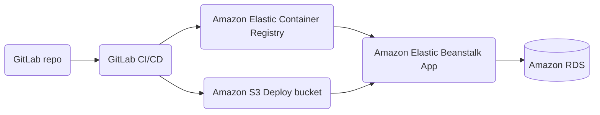

# Task Listing App on AWS

This is a [monorepo](https://github.com/joelparkerhenderson/monorepo_vs_polyrepo) that contains an Angular application at *root* level and also an Express application under `/server`.
This is the application I deployed to AWS.

## The goal

I had to deploy this application as a container onto the AWS infrastructure I created using Terraform.

### Application Architecture

## Deploy the app

After creating the infrastructure using Terraform (found under the Terraform directory of this repository), I had to write some YAML scripts for the purposes of the CICD pipeline (found under the .github/workflow directories):

- A script to run Terraform plan on a pull request to the main branch
- A script to run Terraform plan on a push to the main branch
- A script to deploy the application to the infrastructure created

This last script included the following stages:

- Run a number of tests against the codebase
- Configure AWS credentials (having made a programatic user using IAM)
- Build and push a container image to Amazon ECR
- Call a Bash script to build a DockerRun file and copy this to an S3 bucket
- Deploy to Elastic Beanstalk and update the environment
## Resources

- [Viewing logs from Amazon EC2 instances in your Elastic Beanstalk environment](https://docs.aws.amazon.com/elasticbeanstalk/latest/dg/using-features.logging.html)

